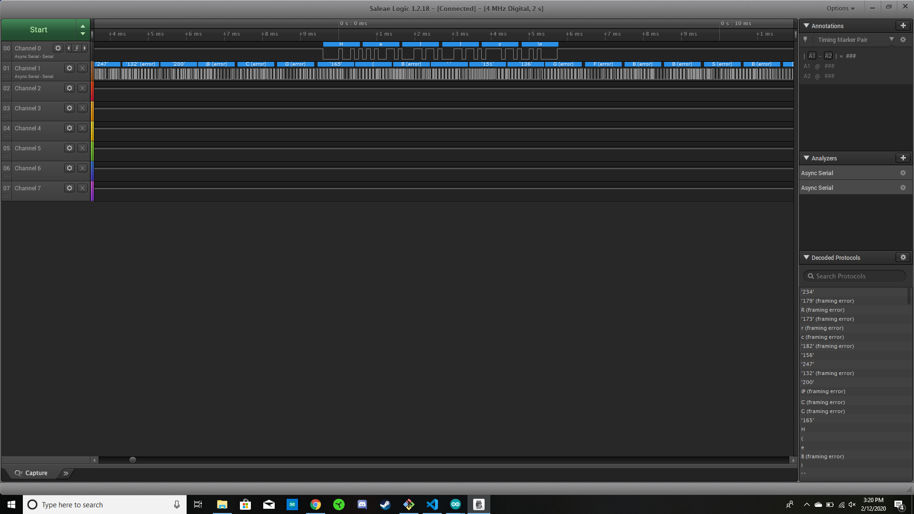

Name:

EID:

Team Number:

## Questions

1. Why does your program need a setup and a loop?

    The setup is to allow for initialization while the loop contains the code that will be constantly running. Seperating the two will make your code efficient t

2. What is the downside to putting all your code in a loop?

    Your code will will constantly loop through unneeded code such as initialization that does not require another loop around. Looping the whole code will cause your program to become very inefficient and take longer to execute.

3. Why does your code need to be compiled?

    Our code needs to be compiled to convert our high level language to machine langauge(binary), so that our ESP32 can understand what we have programmed.

4. When lowering the frequency in procedure A, step 4, what is going wrong? Brainstorm some solutions. Dimmers exist in the real world. What is their solution?

    The light is flickering rather than dimming. A solution to this problem

5. Why do you need to connect the logic analyzer ground to the ESP32 ground?

    If your logic analyzer ground is not connected to ESP32 ground, then both analyzer and chip can be damaged by being blown up with high voltage.

6. What is the difference between synchronous and asynchronous communication?

    Synchronous has both sender/receiver acessing data according to the same clock (No need for a clock signal). Asynchronous has no common clock signal between the sender/receiver. (Needs a clock signal)

7. Profile of UART: Sent X bytes in Y time 

    Took 6.16275 ms

8. Profile of SPI: Sent X bytes in Y time

    your answer here

9. Why is SPI so much faster than UART?

    your answer here

10. list one pro and one con of UART

    One pro is that it requires much less wires than its counter parts but is subjected more noise than that of SPI

11. list one pro and one con of SPI

    One pro is that it is significantly faster than UART but however requires more wires to operate.

12. list one pro and one con of I2C

    One pro is that it only needs 2 pins to operate numerous slave devices but the lines are known to be very prone to interferance so they must be shielded and short.

13. Why does I2C need external resistors to work?

    your answer here

## Screenshots

Procedure A, step 1:

Procedure A, step 4:

Procedure B, UART:

Procedure B, SPI:

